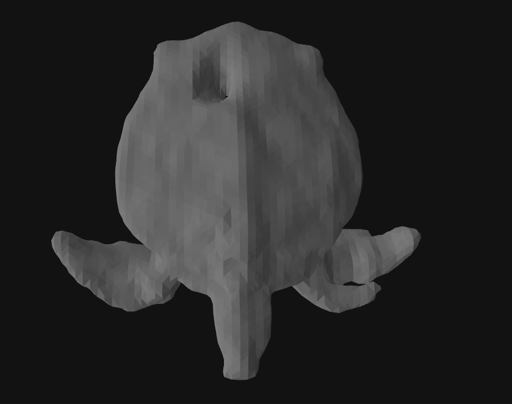

# System Requirements
We ran the demo successfully on a NVIDIA RTX A6000 using CUDA 12.2 with 32 Gb RAM using a single CPU core.
The demo took ~16 minutes to finish.
Running the demo used ~ 8.25 GB of VRAM on our system, so the demo should be run on a system with at least 9 GB of VRAM to be safe. 

# Install Dependencies
We maintained our Python environments using conda. Run the below command in a shell to install the required dependencies. 

`conda env create -f environment.yml`

# Dataset Info
A sample synthetic dataset comes with this demo in the `data/`` folder. It is a simulated turtle, and the camera trajectory setting corresponds to the 0.6x or 0.72m setting described in the paper. Below are some sample images from the dataset. 

## RGB Image


## Sonar Image


# Running the demo
To run our demo after setting up the dependencies, run the following command in a shell:

`python run_sdf.py --conf confs/turtle_reduced_baseline_0.6x_joint_sonar.conf --neus_conf confs/turtle_reduced_baseline_0.6x_joint_rgb.conf --disable_wandb --random_seed 1706110819`

Please feel free to change the `--random_seed` flag to whatever is desired. 

Experiments will be written to `experiments/reduced_baseline_0.6x_joint/{random_seed}` (so for this command, `1706110819`).

# Results
Here are the results after running the command provided on our system:

## Mesh Visualization:



## View Synthesis:


## Mesh Normals:


# Citation
Please cite our work as below:

```
@inproceedings{10.1145/3641519.3657446,
author = {Qadri, Mohamad and Zhang, Kevin and Hinduja, Akshay and Kaess, Michael and Pediredla, Adithya and Metzler, Christopher A},
title = {AONeuS: A Neural Rendering Framework for Acoustic-Optical Sensor Fusion},
year = {2024},
isbn = {9798400705250},
publisher = {Association for Computing Machinery},
address = {New York, NY, USA},
url = {https://doi.org/10.1145/3641519.3657446},
doi = {10.1145/3641519.3657446},
booktitle = {ACM SIGGRAPH 2024 Conference Papers},
articleno = {127},
numpages = {12},
keywords = {3D reconstruction, imaging sonar, implicit neural representations, inverse rendering, multimodal sensing, neural rendering, robotics, sensor fusion, signed distance functions, underwater imaging, underwater sensing},
location = {Denver, CO, USA},
series = {SIGGRAPH '24}
}
```

# Credits
This codebase is mostly adapted from https://github.com/Totoro97/NeuS. Thanks to the authors!

